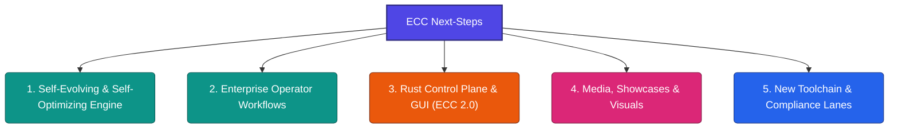

# 🧠 Everything Claude Code (ECC) — Next-Step Brainstorming & Roadmap

This document outlines concrete, high-fidelity implementation ideas for the [everything-claude-code](file:///D:/Projects/Misc/everything-claude-code) repository. These proposals are derived directly from the current catalog of **228 skills** and **47 agents**, aligning with the sprint priorities defined in [WORKING-CONTEXT.md](file:///D:/Projects/Misc/everything-claude-code/WORKING-CONTEXT.md) (e.g., control plane primitives, operator workflows, self-improving skills, media explainer lanes, and Rust control plane integration).

---

## 🗺️ High-Level Themes at a Glance

---

## 🔄 Theme 1: Self-Evolving & Self-Optimizing Skills

The core promise of ECC is a self-improving system that learns from developer sessions. Currently, `continuous-learning-v2` and `rules-distill` lay the foundation, but the loop can be tightened with deeper automation.

### 1.1 Automatic Hook-Loop Prompt Pruner
*   **The Idea**: Create an automated command or background hook (`/prune-prompts` or `rules-pruner`) that monitors your session logs, tracks rule violations and token consumption, and identifies redundant or low-signal rules. It suggests removals or consolidations to keep system prompts lean.
*   **Target Skill Location**: [skills/rules-distill](file:///D:/Projects/Misc/everything-claude-code/skills/rules-distill) & [skills/continuous-learning-v2](file:///D:/Projects/Misc/everything-claude-code/skills/continuous-learning-v2)
*   **Why It Matters**: Prevents "context bloating" from accumulating rules over time. If a rule is never violated or has 100% compliance over 50 sessions, it can be archived from the active system prompt.

### 1.2 Continuous Skill Back-Testing (Drift Evaluator)
*   **The Idea**: Run regression checks on updated skills. When a skill is modified by `continuous-learning-v2`, the `agent-eval` harness automatically executes the new skill against historical chat logs/inputs to ensure that the changes do not cause "performance drift" or weaken response formatting.
*   **Target Skill Location**: [skills/agent-eval](file:///D:/Projects/Misc/everything-claude-code/skills/agent-eval) & [skills/eval-harness](file:///D:/Projects/Misc/everything-claude-code/skills/eval-harness)
*   **Why It Matters**: Guarantees safety when letting an AI autonomously update its own instruction templates. If the updated skill fails past validation benchmarks, it rolls back automatically.

### 1.3 Bayesian Instinct Weight Optimizer
*   **The Idea**: Track the user's manual override patterns. If a developer repeatedly skips a rule suggested by `rules-distill` or ignores a warning from a security hook, the system recalculates that rule’s confidence weight. If the weight falls below a certain threshold, the rule is automatically disabled.
*   **Target Skill Location**: [skills/rules-distill](file:///D:/Projects/Misc/everything-claude-code/skills/rules-distill)
*   **Why It Matters**: Eliminates annoying "false alarms" and keeps the rules highly relevant to the developer's actual workflow.

---

## 💼 Theme 2: Enterprise Operator Workflows

The sprint context mentions moving toward "connected workflows wrapping connected surfaces instead of raw APIs." This means building high-value, multi-step orchestration chains.

### 2.1 Jira-to-PR Full Lifecycle Automator
*   **The Idea**: Extend [skills/jira-integration](file:///D:/Projects/Misc/everything-claude-code/skills/jira-integration) and [skills/github-ops](file:///D:/Projects/Misc/everything-claude-code/skills/github-ops) into a unified end-to-end task runner. The agent pulls an assigned issue from Jira ➔ runs codebase research ➔ generates a `blueprint` construction plan ➔ writes the code ➔ triggers the local `verification-loop` ➔ builds a PR ➔ and updates the Jira ticket status with the PR link and test reports.
*   **Target Skill Location**: [skills/jira-integration](file:///D:/Projects/Misc/everything-claude-code/skills/jira-integration)
*   **Why It Matters**: Standardizes the software development lifecycle (SDLC) for engineering teams, turning the agent from a simple coding assistant into a junior developer capable of handling entire tickets autonomously.

### 2.2 DevSecOps Production Incident Response Runbook
*   **The Idea**: Create a specialized incident responder skill (`incident-responder`). When triggered with a production error alert or log dump, it runs diagnostics, identifies potential culprits in recent git commits, spins up an isolated sandbox, writes a patch, and prepares a rollback report.
*   **Target Skill Location**: [skills/security-review](file:///D:/Projects/Misc/everything-claude-code/skills/security-review) & [skills/agent-introspection-debugging](file:///D:/Projects/Misc/everything-claude-code/skills/agent-introspection-debugging)
*   **Why It Matters**: Minimizes production downtime by using the agent's rapid reading speed to isolate bugs and draft security patches within seconds of an incident.

### 2.3 Conversational Slack/Discord Operator Hub
*   **The Idea**: Build a wrapper skill (`operator-messaging`) to draft and send project status updates. Instead of just printing reports to the terminal, the agent can post structured Slack/Discord cards detailing deployment success, test failures, or security audit logs directly to engineering channels.
*   **Target Skill Location**: [skills/unified-notifications-ops](file:///D:/Projects/Misc/everything-claude-code/skills/unified-notifications-ops)
*   **Why It Matters**: Integrates AI results directly into team communication channels, making agent activities visible and collaborative.

---

## 🦀 Theme 3: Rust Control Plane & GUI (ECC 2.0)

ECC 2.0 is currently in-tree as an alpha Rust prototype (`ecc2`). Building this control plane is a high-priority track to replace slower shell and Node-based scripts.

### 3.1 Sub-10ms Hook Execution Engine
*   **The Idea**: Port the PreToolUse and PostToolUse hook parsers directly into the Rust daemon (`ecc2`). Instead of spawning slow Node.js processes for design-quality and security checks on every tool call, the Rust daemon intercepts tool calls, parses them, and runs validations instantly.
*   **Target Location**: [ecc2/src/](file:///D:/Projects/Misc/everything-claude-code/ecc2)
*   **Why It Matters**: Massive performance boost. Running checks in Node.js adds 200–500ms of lag per tool call. A native Rust interceptor brings this down to <10ms, making the agent feel incredibly snappy.

### 3.2 Visual Session Explorer & Brancher (GUI integration)
*   **The Idea**: Integrate a timeline viewer into the Tkinter-based dashboard (`ecc_dashboard.py`). Developers can visually inspect their SQLite state store, browse past sessions, see tool call counts/costs, and click to "branch" an older session into a new terminal instance.
*   **Target Location**: [ecc_dashboard.py](file:///D:/Projects/Misc/everything-claude-code/ecc_dashboard.py)
*   **Why It Matters**: Provides a clear interface for session management, making it easy to recover from failed coding trajectories or inspect past agent behaviors.

### 3.3 Dynamic Token Budget Guard Daemon
*   **The Idea**: Implement an active rate-limiting daemon in Rust that tracks cumulative token usage and API costs in real time. If a session enters a loop and starts bleeding tokens, the daemon triggers a hard halt, saving the developer from unexpected API bills.
*   **Target Location**: [ecc2/src/](file:///D:/Projects/Misc/everything-claude-code/ecc2)
*   **Why It Matters**: Safety net for loops. Agents can occasionally get stuck in self-invoking error loops; a daemon-level budget guard stops them before they waste credits.

---

## 🎬 Theme 4: Media, Showcases & Visuals

The sprint focuses heavily on technical explainers, animations, and launching content.

### 4.1 Automated Architecture Explainer (Manim Scene Generator)
*   **The Idea**: Build an agent workflow that takes a `git diff` or a `CLAUDE.md` architecture diagram and automatically writes python-manim scene code. Running the generated script outputs a professional, animated video explaining how the codebase structure changed.
*   **Target Skill Location**: [skills/manim-video](file:///D:/Projects/Misc/everything-claude-code/skills/manim-video)
*   **Why It Matters**: Perfect for public launches, open-source PR explanations, and onboarding new developers to complex refactoring changes.

### 4.2 Playwright-to-Remotion Sandbox Showcase
*   **The Idea**: Chain Playwright E2E browser tests with [skills/remotion-video-creation](file:///D:/Projects/Misc/everything-claude-code/skills/remotion-video-creation). The agent runs browser tests, captures screenshots/videos of the UI interactions, and automatically compiles them into a premium Remotion video showcase (complete with progress bars, zoom transitions, and text overlays) to post on GitHub.
*   **Target Skill Location**: [skills/remotion-video-creation](file:///D:/Projects/Misc/everything-claude-code/skills/remotion-video-creation) & [skills/browser-qa](file:///D:/Projects/Misc/everything-claude-code/skills/browser-qa)
*   **Why It Matters**: Enhances pull requests with visual evidence of UI features, saving reviewers from having to pull and run frontend code locally.

---

## 🛡️ Theme 5: New Toolchain & Compliance Lanes

Expanding ECC's multi-language rules and domain compliance keeps the platform versatile.

### 5.1 Web3 & Smart Contract Security Audit Pack
*   **The Idea**: Add support for Solidity and Web3 workflows. Build standard rules (`rules/solidity/`) and audit skills (`defi-security`) that run static analysis tools (Slither, Mythril) and audit contract code for common vectors like reentrancy, overflow, or front-running vulnerabilities.
*   **Target Location**: [rules/web/](file:///D:/Projects/Misc/everything-claude-code/rules/web) & [skills/defi-amm-security](file:///D:/Projects/Misc/everything-claude-code/skills/defi-amm-security)
*   **Why It Matters**: Blockchain environments are high-stakes. Native smart contract audit rules protect developers from shipping costly security bugs.

### 5.2 CMake / C++ Compiler Diagnostic Resolver
*   **The Idea**: Create a skill that parses C/C++ compiler warnings and `clang-tidy` lint reports, resolves build issues, and suggests safe, modern C++ (e.g., C++20/23 smart pointers, structured bindings, concepts) replacements.
*   **Target Skill Location**: [skills/cpp-testing](file:///D:/Projects/Misc/everything-claude-code/skills/cpp-testing) & [skills/cpp-coding-standards](file:///D:/Projects/Misc/everything-claude-code/skills/cpp-coding-standards)
*   **Why It Matters**: C++ compiler logs can be incredibly verbose and cryptic. An agent-led diagnostic resolver saves hours of debugging time on large legacy codebases.
