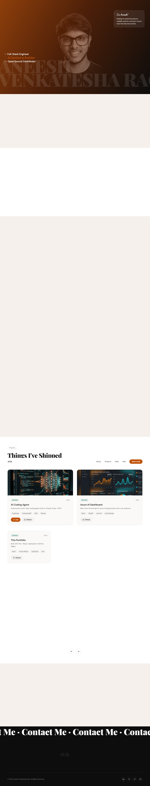
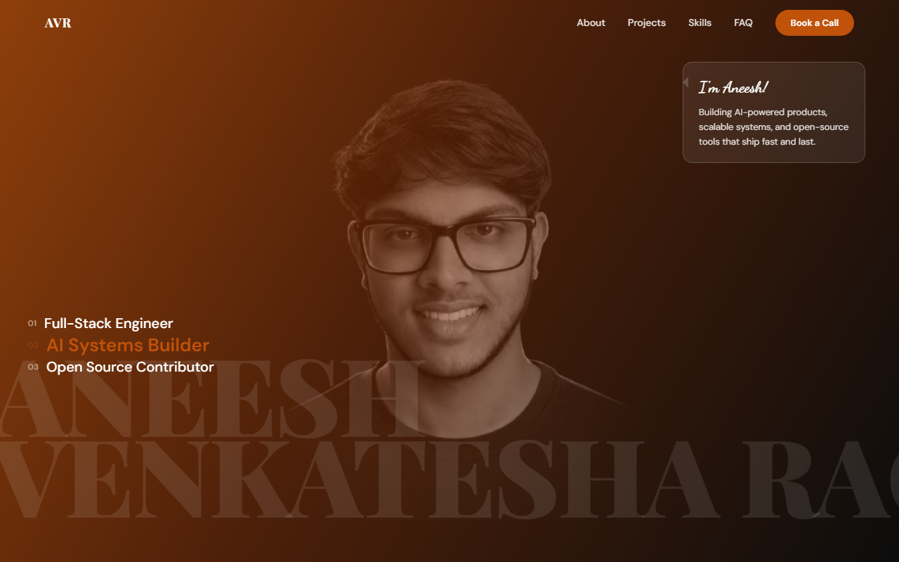
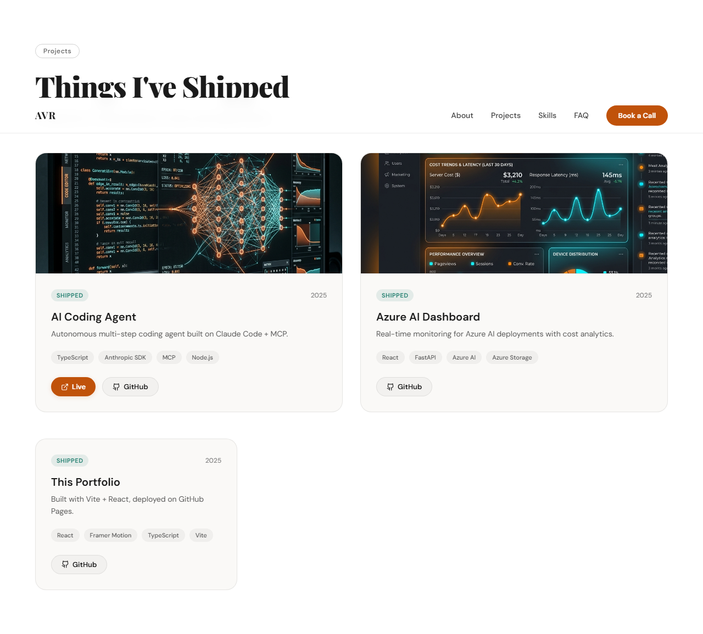

# 🌟 Aneesh Venkatesha Rao — Developer Portfolio

A sleek, premium, high-fidelity developer portfolio built from scratch to showcase systems programming, AI/ML integrations, and hardware-software codesign.



---

## 🎨 Design Philosophy & User Experience

The website is styled using a modern, responsive **Glassmorphic Design** system with vanilla CSS. It implements a carefully structured background-alternating pattern to distinguish sections and maintain visual interest:

$$\text{Dark (Hero)} \longrightarrow \text{Beige (About)} \longrightarrow \text{Light (Toolkit)} \longrightarrow \text{Beige (Experience)} \longrightarrow \text{Light (Method)} \longrightarrow \text{Beige (Projects)} \longrightarrow \text{Light (Certifications)} \longrightarrow \text{Beige (FAQ)} \longrightarrow \text{Dark (Contact \& Footer)}$$

### Key Interface Highlights

*   **Floating Glassmorphic Navbar**: A header featuring dynamic CSS blur filters (`backdrop-filter`) and borders. Upon scrolling down, it collapses into a floating pill shape. It tracks active sections dynamically, highlighting the corresponding nav link in real time.
*   **Typing Hero Greeting**: A greeting card featuring ECE and AI-focused roles, animated with a micro-interactive typewriter typewriter header using Framer Motion.
*   **Live GitHub Commit Calendar**: An interactive calendar card that queries the live GitHub history API, filters future dates, and displays the **last 365 days** of activity in a high-contrast, custom emerald-green contribution grid.
*   **Filtered Technical Toolkit**: A tabbed list sorting programming languages, backend frameworks, databases, and low-level FPGA/Verilog tools based on verified codebase evidence.
*   **Project Specification Drawers**: Clicking a project card triggers an animated, slide-out drawer containing detailed project notes, specifications, repository links, and architecture diagrams.
*   **Security & Anti-Spam Safeguards**: The contact form features a client-side honeypot field, 30-second submission rate limiting, and hides sensitive personal details behind a click-to-reveal toggle state to prevent crawler indexing.

---

## 📸 Section Breakdowns

### 1. Hero & Monogram Navigation


### 2. Things Built (Projects Grid)


---

## 🛠️ Tech Stack & Architecture

The application is built entirely on a modern static React structure:

*   **Framework**: [React 19 (TypeScript)](https://react.dev/)
*   **Build Tooling**: [Vite 8 & Rollup](https://vite.dev/)
*   **Styling**: Vanilla CSS (design tokens defined inside [src/styles/tokens.css](file:///d:/Projects/ML/portfolio/src/styles/tokens.css))
*   **Animations**: [Framer Motion 12](https://www.framer.com/motion/)
*   **Icons**: Custom inline SVG React components consolidated in [src/components/ui/icons.tsx](file:///d:/Projects/ML/portfolio/src/components/ui/icons.tsx)
*   **Asset Loading**: Dynamic loaders utilizing Vite's `import.meta.glob` helper inside [src/utils/images.ts](file:///d:/Projects/ML/portfolio/src/utils/images.ts)

---

## ⚙️ Performance & Security Hardening

*   **Rollup Code Splitting**: Optimized Rollup chunks in `vite.config.ts` isolate heavy libraries (`react`, `framer-motion`, `lucide-react`) into standalone cacheable vendor assets. This keeps the primary JS bundle size **under 64KB**.
*   **Strict Content Security Policy (CSP)**: Hardened `<meta>` CSP header inside `index.html` blocks third-party script injection and strictly limits resource loading to trusted endpoints (e.g. EmailJS, Plausible, and jogruber's GitHub API).
*   **Dynamic Font Preloading**: Asynchronously preloads Google Fonts (Playfair Display and DM Sans) using `<link rel="preload">` to eliminate Layout Shifts (CLS) and avoid render-blocking delays.

---

## 🚀 Development & Local Commands

To start the local environment and verify compile/test integrity:

### 1. Clone & Install Dependencies
```bash
git clone https://github.com/AneeshVRao/portfolio.git
cd portfolio
npm install
```

### 2. Start Development Server
```bash
npm run dev
```

### 3. Build Production Bundle
```bash
npm run build
```

### 4. Code Quality & Format Linter
```bash
npm run lint
```

### 5. Automated E2E Verification
Run the Playwright test suite to simulate navigation, project drawer toggles, FAQ accordions, and form validations:
```bash
node test-portfolio.cjs
```

---

## 🚀 Automated Deployment Pipeline

The codebase includes a GitHub Actions CI/CD deployment workflow inside `.github/workflows/deploy.yml` that:
1.  Validates code style and TypeScript compiler constraints (`npm run lint`).
2.  Compiles the production static assets (`npm run build`).
3.  Copies the custom `CNAME` file from `public/` into the `dist/` directory automatically.
4.  Deploys the static assets directly to GitHub Pages using secure token permissions (`pages: write`, `id-token: write`).
5.  Serves the site under the custom domain [https://aneesh.codes/](https://aneesh.codes/).
